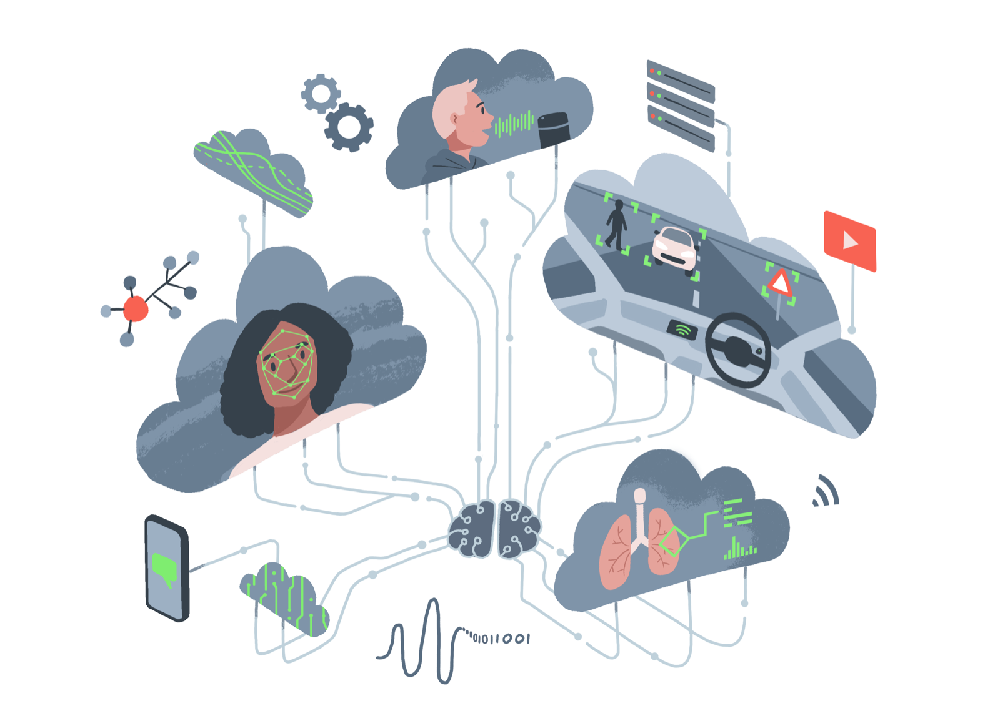

---
hide:
  - navigation
  - toc
---

# Welcome

{width="50%"}

Hello 👋
This is the Turing Commons—a home for resources and tools to help you reflect, discuss, and take responsibility for the design, development, and use of data-driven technologies.

Confused by that last sentence?
Don't worry you're still in the right place.
We have a range of resources for those curious about the ethical and responsible use of data, regardless of whether you're a curious citizen looking to have greater control over local matters, or a data scientist looking to take more responsibility over the consequences of your research.

This site is a living resource, however, which means the content is constantly being updated, revised, and refined. At present, the site is a home for several guidebooks, which have been designed for specific training courses we are in the process of delivering.

These guidebooks are themselves being updated and added to, so may be in different states of completeness and readiness. You can access them via the links below, or using the menu on the left.

- [Responsible Research and Innovation (RRI)](rri/index.md)
- [Public Engagement of Data Science and AI (PED)](ped/index.md)
- [AI Ethics & Governance (AEG)](aeg/index.md)
- [Citizen's Guide to Data: Ethical, Social and Legal Issues](https://zenodo.org/record/5568861#.YWfmRS8w1hE)

## Contributing

If you'd like to get involved and help contribute to these resources, you can either:

- Contribute on GitHub:
  - Comment on [issues](https://github.com/alan-turing-institute/turing-commons/issues), join a discussion, collaborate on an ongoing task and exchange your thoughts with others.
  - Can't find your idea being discussed anywhere? [Open a new issue](https://github.com/alan-turing-institute/turing-commons/issues/new)!
- Just want to get in touch? Feel free to send us an email: [cburr@turing.ac.uk](mailto:cburr@turing.ac.uk).
